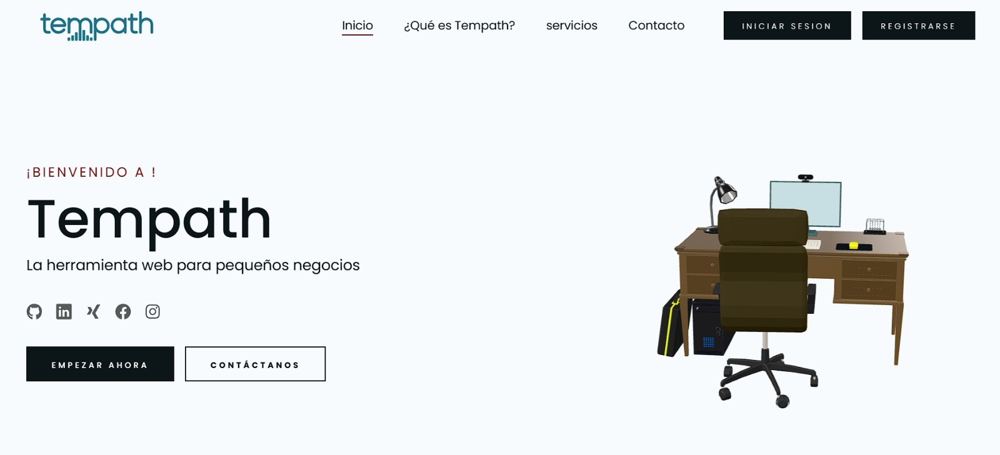

# Tempath

Tempath es una herramienta digital enfocada en facilitar a pequeños negocios en la creación de su propio sitio web sin necesidad de conocimientos en programación o diseño. A través de un formulario guiado y opciones prediseñadas, el usuario puede generar y publicar su página web de forma rápida, sencilla y funcional.


---

## Funcionalidades Implementadas

### Sistema de Autenticación
- **Registro de usuarios** con email y contraseña
- **Inicio de sesión** seguro con Firebase Auth
- **Recuperación de contraseña** por email
- **Protección de rutas** - redirección automática según estado de autenticación
- **Persistencia de sesión** - mantiene al usuario logueado

###  Formulario de Configuración (3 Pasos)

#### Paso 1: Información Básica
- Nombre del negocio
- Descripción del negocio
- Teléfono de contacto
- Validación en tiempo real
 
#### Paso 2: Redes Sociales y Ubicación
- **Redes sociales dinámicas**: Instagram, Facebook, LinkedIn, TikTok
- Dirección del negocio
- Enlace de Google Maps
- Horarios de atención
- **Campos opcionales** con validación
 
#### Paso 3: Personalización
- **Subida de logo** con drag & drop
- **Galería de imágenes** (hasta 6 imágenes)
- **Selector de colores** primario y secundario
- **Vista previa en tiempo real**
- **Validación de archivos** (tamaño, formato)

###  Gestión de Imágenes
- **Integración con Cloudinary** para almacenamiento optimizado
- **Drag & drop** para subida de archivos
- **Compresión automática** de imágenes
- **Validación de formatos** (JPG, PNG, SVG para logos)
- **Límite de tamaño** (25MB por imagen)
- **Vista previa instantánea** antes de subir

###  Sistema de Plantillas
- **3 plantillas prediseñadas**: Minimal, Classic, Modern
- **Generación dinámica** con datos del usuario
- **Vista previa interactiva** antes de seleccionar
- **Responsive design** para todos los dispositivos
- **Integración automática** de WhatsApp

###  Base de Datos
- **Firebase Realtime Database** para almacenamiento
- **Estructura organizada** por usuario
- **Campos separados** para redes sociales y galería
- **Timestamps** para control de versiones
- **Modo edición** para actualizar información

---

##  Características Técnicas

###  Responsive Design
- **Mobile-first approach**
- **Breakpoints optimizados** para tablet y desktop
- **Navegación adaptativa**
- **Imágenes responsivas** con lazy loading

### ⚡ Performance
- **Código JavaScript vanilla** (sin frameworks pesados)
- **Lazy loading** de imágenes
- **Compresión automática** vía Cloudinary
- **Minificación** de CSS
- **Optimización** de carga de recursos

###  Seguridad
- **Autenticación Firebase** con tokens seguros
- **Validación client-side y server-side**
- **Sanitización** de inputs
- **Protección CSRF** integrada
- **HTTPS** obligatorio en producción

---

##  Instalación y Configuración

### 1. Clonar el Repositorio
```bash
git clone https://github.com/zenriquezs/tempath-web.git
cd tempath-web
```

### 2. Instalar Dependencias
```bash
npm install
```

### 3. Configurar Variables de Entorno
Crea un archivo `.env` con:
```env
FIREBASE_API_KEY=tu_api_key
FIREBASE_AUTH_DOMAIN=tu_auth_domain
FIREBASE_PROJECT_ID=tu_project_id
CLOUDINARY_CLOUD_NAME=tu_cloud_name
CLOUDINARY_UPLOAD_PRESET=tu_upload_preset
```

### 4. Ejecutar en Desarrollo
```bash
npm run dev
# o simplemente abrir index.html en Live Server
```

### 5. Configurar Firebase
1. Crear proyecto en [Firebase Console](https://console.firebase.google.com/)
2. Habilitar **Authentication** con Email/Password
3. Configurar **Realtime Database** con reglas de seguridad
4. Actualizar `firebaseConfig.js` con tus credenciales

### 6. Configurar Cloudinary
1. Crear cuenta en [Cloudinary](https://cloudinary.com/)
2. Crear upload preset sin autenticación
3. Configurar folder "business-logos"
4. Actualizar credenciales en el código

---

##  Despliegue

### Firebase Hosting
```bash
npm install -g firebase-tools
firebase login
firebase init hosting
npm run build
firebase deploy
```

### Netlify
1. Conectar repositorio en Netlify
2. Configurar build command: `npm run build`
3. Configurar publish directory: `dist/`
4. Agregar variables de entorno

---

## Flujo de Usuario

1. **Landing Page** → Usuario ve información del producto
2. **Registro/Login** → Autenticación segura
3. **Formulario Paso 1** → Información básica del negocio
4. **Formulario Paso 2** → Redes sociales y ubicación
5. **Formulario Paso 3** → Personalización visual
6. **Vista Previa** → Selección de plantilla
7. **Publicación** → Generación del sitio (próximamente)

---

##  Roadmap y Mejoras Futuras

### Fase 2 - Publicación
- [ ] Generación de subdominios automáticos
- [ ] Sistema de hosting integrado
- [ ] Panel de administración del sitio
- [ ] Analytics básicos

### Fase 3 - Funcionalidades Avanzadas
- [ ] Editor visual drag & drop
- [ ] Más plantillas y temas
- [ ] Integración con pasarelas de pago
- [ ] Sistema de citas online
- [ ] Catálogo de productos
- [ ] Blog integrado

### Fase 4 - Escalabilidad
- [ ] Dominios personalizados
- [ ] Chatbot con IA
- [ ] Integración con redes sociales
- [ ] SEO automático
- [ ] Backup y versionado

---

##  Problemas Conocidos y Soluciones

### Subida de Imágenes
- **Problema**: Error "Failed to fetch" en Cloudinary
- **Solución**: Verificar upload preset y configuración CORS

### Autenticación
- **Problema**: Redirección infinita en login
- **Solución**: Verificar reglas de Firebase Auth

### Responsive
- **Problema**: Formulario no se ve bien en móviles pequeños
- **Solución**: Ajustar breakpoints en media.css

---

## Contribución

### Cómo Contribuir
1. Fork el repositorio
2. Crear rama feature: `git checkout -b feature/nueva-funcionalidad`
3. Commit cambios: `git commit -m 'Agregar nueva funcionalidad'`
4. Push a la rama: `git push origin feature/nueva-funcionalidad`
5. Crear Pull Request

### Estándares de Código
- **JavaScript**: ES6+ con comentarios descriptivos
- **CSS**: BEM methodology para clases
- **HTML**: Semántico y accesible
- **Commits**: Conventional Commits format

---

##  Métricas y Analytics

### Métricas Actuales
- **Tiempo de carga**: < 3 segundos
- **Compatibilidad**: Chrome 80+, Firefox 75+, Safari 13+
- **Responsive**: 100% compatible móvil/tablet/desktop
- **Accesibilidad**: WCAG 2.1 AA parcial

---

## Soporte y Contacto

### Equipo de Desarrollo
- **Frontend Lead**: Enrique Zuñiga Y Sergio Hdz
- **Backend**:Enrique Zuñiga
- **UI/UX**:  Enrique Zuñiga Y Sergio Hdz

### Contacto
- **Email**: zenrizu@gmail.com
- **LinkedIn**: [Enrique Zuñiga](https://www.linkedin.com/in/enrique-zu%C3%B1iga-zu%C3%B1iga-6118b82b0/)
- **Portfolio**: [zenriquezs.github.io](https://zenriquezs.github.io/EnriqueZS/)
- **Repositorio**: [GitHub](https://github.com/zenriquezs/tempath-web)

---

##  Licencia

Este proyecto está bajo la Licencia MIT. Ver el archivo `LICENSE` para más detalles.

---
